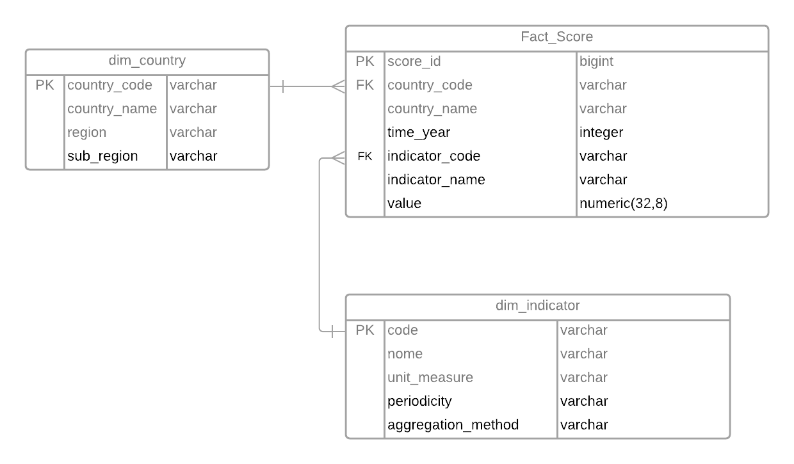
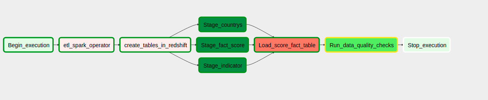

# Data Engineering Capstone Project

## Project Summary

The purpose of the project is to build an ETL pipeline that extracts data from S3, stages it in Redshift, and save data into a dimensional tables for analysis and insights. It can be grouped by time period (year) or by different granularity of locality (countries, regions, sub-regions).  It be possible to separate by type of indicators (personal perceptions, development indicators, economic indicators). For example, we could try to track the value of a country's external debt over the years.

## Sources:

- [Countries with Regional Codes](https://github.com/lukes/ISO-3166-Countries-with-Regional-Codes/blob/master/all/all.json)
- [Indicators e WDI data](https://datatopics.worldbank.org/world-development-indicators/#archives)

### Datasets

- all.json: contains informations about the countries (codes, name, region, sub-region, ...)
- Indicator: contains data of the indicators (name, description, measure, frequency ..)
- WDIData.csv: contains world development indicators per country, year and indicator. [More information](https://www.worldbank.org/en/who-we-are)

## Data Model

 A star schema with a fact table score with the dimensions location and indicators as shown in the image below:

 

## Tools used

ETL was performed using Spark, which partitions the data and assigns it to individual worker nodes and if the data grows it can easily be added to the Spark cluster. Airflow was used to automate this process, as it allows the creation of dynamic data pipelines built from reusable tasks, which can be monitored and easy to use. To storage the data was used Amazon Redshift which provides an excellent scale-out option as your data and query complexity grows.

The  airflow graph view it looked like this:

## Additional questions
  - If the data was increased by 100x.
    - The use of pyspark helps in processing large amounts of data, but change to incremental updates would be important.  This would require creating a clutser on redshift that holds more nodes too.

  - If the pipelines were run on a daily basis by 7am.
      - If the indicators had metrics generated more frequently than annually, this would require a change to the airflow dag schedule configuration in capstone_nanodegree.py file: 

   		>>dag = DAG('capstone_nanodegree_dag',  
          	>>default_args=default_args,  
          	>>description='Load and transform data in Redshift with Airflow',  
          	>>schedule_interval='0 7 * * *'  
        )

  - If the database needed to be accessed by 100+ people.
    Data is being stored in Redshift, which can easily scale to handle 100+ people accessing the data. Can be used dashboard tools, like tableau, which permits that people access the information too.
